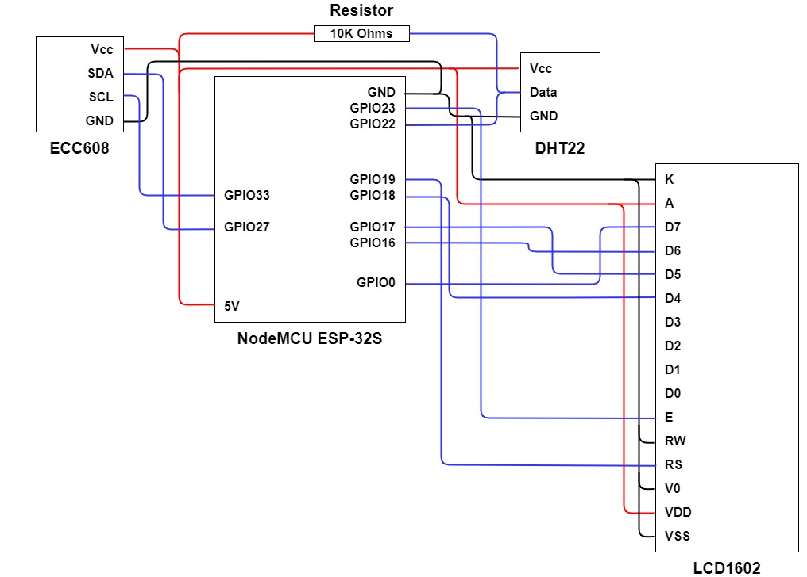

# ESP32 With ECC608

### Summary

This project connects DHT22, ATECC608A, and an LCD1602 to an ESP32 development board (specifically, NodeMCU ESP-32S). Depends on ESP-IDF v4.x (tested in 4.1).

### Hardware Setup

### Components

* NodeMCU ESP-32S
* LCD1602 module
* DHT22 
* ATECC608A SOIC

### Schematic:

