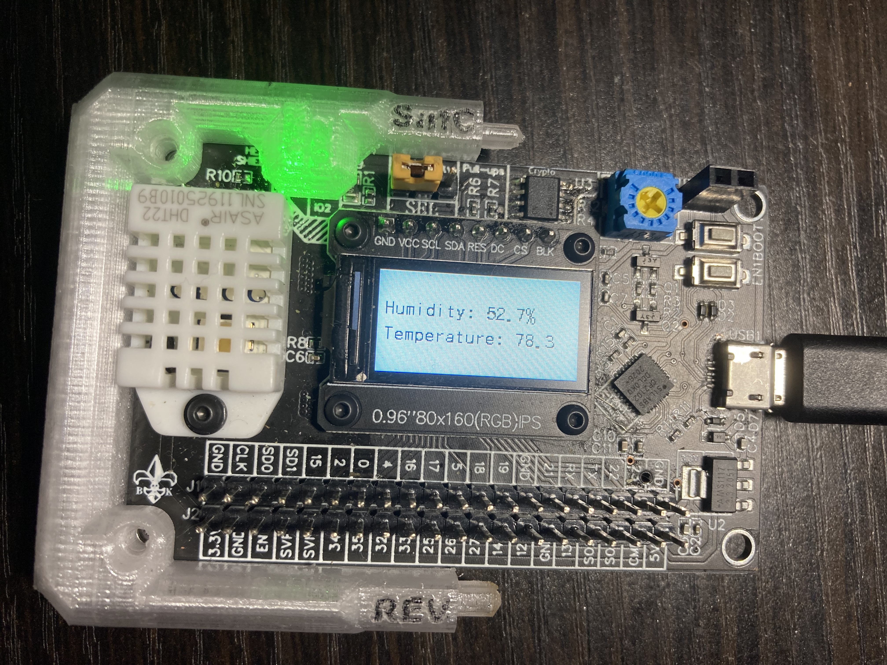

# ESP32 With ECC608, DHT22, and ST7735

### Summary

This project connects DHT22, ATECC608A, and an ST7735 LCD to a a custom-designed ESP32 development board. Depends on ESP-IDF v4.x (tested in 4.1).

### Hardware Setup

The hardware setup is minimal, since our board incorporates the necesssary modules and sensors. See below:

